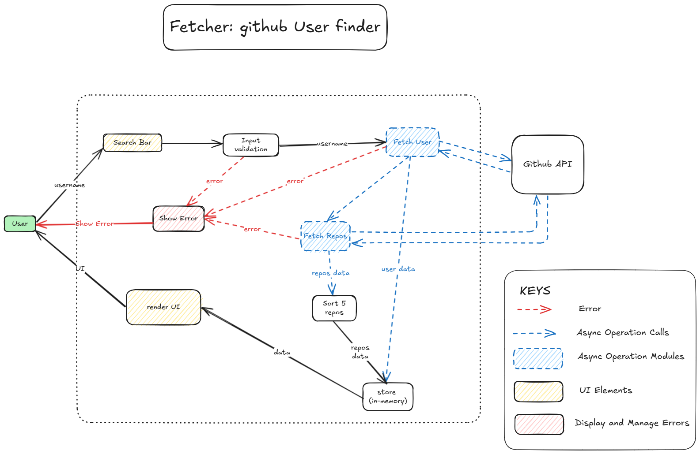

# Fetcherr - Github User Fetcher App

A simple web app that take username as input and fetcher github user profile and top 5 repos accoding to stargazers_count.

We build this to practice async logic, working with external API's.

---

## Screenshot


---

## Features

- Find github user and show its profile.
- Search for users repositories and sort them accoriding to startgazers_count and select top 5 repositories and show.

---

## Architecture / Data Flow Diagram


---

## How to Run

```bash
# Clone the repo
git  clone  https://github.com/asim-momin-7864/Javascript-learning.git

# Open the project
cd Javascipt-learning
cd Learning  Practice  Projects
cd 10-github-fetcher 

# Just open in browser (no install needed for HTML/CSS/JS)
open index.html
```
---

## How to Use

1. Enter a username in input field.
2. Click Search Button.
3. Click Reset Button to reset app.

---

## Concepts Practiced

- Async Operations.
- External API's.
- HTML forms and input handling
- JavaScript DOM manipulation
- Event listeners

---

## Lessons Learned

- Central error handling system. 
- Pipeline Flow vs Centralized Control Architecture.
- How to write clean code.

---

## Future Improvements

- We can use more github API's and add features that can manage our github from this app without going to use github.

---

## Tech Used

- HTML5
- CSS3
- Vanilla JavaScript
- Github API

---

## License

MIT — free to use and modify

---

> Built by [Asim Momin](https://github.com/asim-momin-7864) | Learning in public 