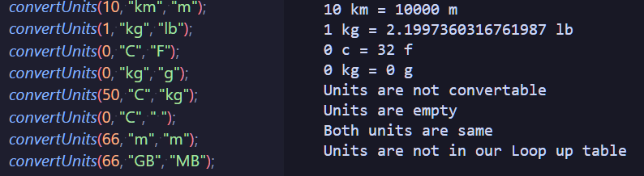
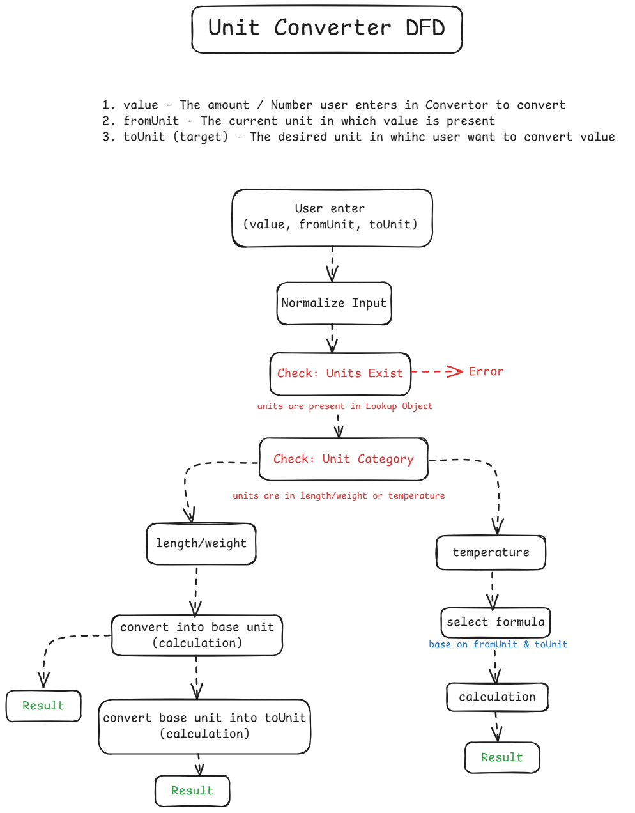

# Unityy — Unit Converter (Length, Weight, Temperature)

This is a simple Node.js app that converts bewteen length, weight, and temperature units.
 It was build to practice data-driven logic and input validation.

---

## Screenshot



---

## Features

- Convert between length (m, km, cm), weigth (kg, g, lb), and temperature ( C, F, K ) .
- Inout validation with user friendly error messages.
- Data driven conversion logic using a lookup table.

---

## DFD



---

## How It Works

The converter uses a lookup table thats stores conversion factors relative to a base unit. 
All Values are first normalized to the base unit and then converted to target unit, Which avoids maintining multiple conversion formulas.

---

## How to Run

```bash
# Clone the repo
git clone https://github.com/asim-momin-7864/Javascript-learning.git

# Open the project
cd Javascript-learning
cd Learning Practice Projects
cd 8-unit-converter

# Run file through node
node unitConverter-fixed.js
```
---

## How to Use

1. Take `convertUnit( )` function at bottom of file
2. Pass parameters -- `value`, `fromUnit`, `toUnit`
3. Run file through node
4. See result in terminal  

---

## Concepts Practiced

- Event listeners
- Input sanitization
- data driven logic (lookup table)

---

## Lessons Learned

- Reducing the excessive use of if-else logic and finding an alternative pattern was the main challenge.
- Creating a lookup table solution for our above challenge is time-consuming; we store unit types, and base units conversion values are hard to build their logic.
- Keeping a base unit for each type of unit and converting it again into another unit using reverse formula logic 
 is a challenging part to build. This reduces the need for multiple formulas, e.g. km --> cm and makes the programme size efficient. 
- Checking units convertability, do they belong to the same units category? Building logic for it is time-consuming and new to me.

---

## Future Improvements

- Add UI for this programme.
- Add more type of units

---

## Tech Used

- Vanilla JavaScript

---

## License

MIT — free to use and modify

---

> Built by [Asim Momin](https://github.com/asim-momin-7864) | Learning in public 