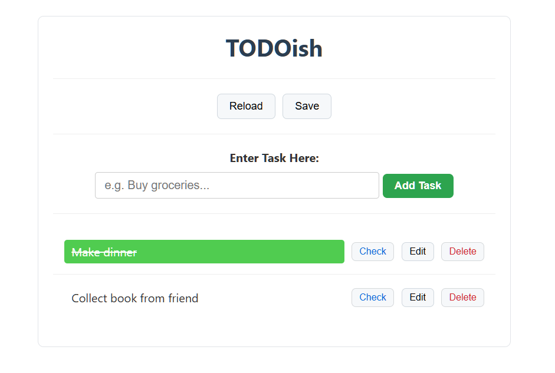
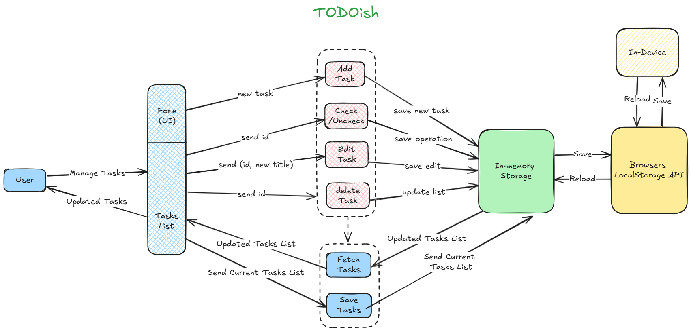

# TODOish - Task Management Web App

TODOish is a  task management web app build to handle daily chores. it allows users to Add, Edit, Check, Delete tasks and manage TODO list.
This app was built to practice DOM Manipulation, event delegation and local state management using JS

---

##  Screenshot



---

## Features

- Manage TODO list - Add, Edit, Check/Uncheck, Delete Tasks.
- Locally save TODO list in current state .
- Reload saved TODO list.

---

## Diagrams

### System Context (C4 - level 1) Diagram


---

### App Logic Diagram


---

## How to Run

```bash
# Clone the repo
git clone https://github.com/asim-momin-7864/Javascript-learning.git

# Open the project
cd Javascipt-learning
cd Learning Practice Projects
cd 9-task-manager-DOM

# Just open in browser (no install needed for HTML/CSS/JS)
open index.html
```

---

## How to Use

1. Enter the task title in the input bar.
2. Click on "Add Task".
3. Click the "Check" button to check/uncheck the task.
4. Click the "Edit" button to edit the task. Then type a new title in the input bar and click the "Add Task" button.
5. Click the "Delete" button to delete the task. 
6. Before exiting, click the "Save"  button to store the current TODO list in local storage.
3. In the next session, after opening the app, click the "Reload" button to get the saved TODO list.

---

## Concepts Practiced

- HTML forms and input handling
- JavaScript DOM manipulation
- Event listeners
- Browsers localStorage
- Basic CSS styling 

---

## Lessons Learned

- Tasks are saved to localStorage and reloading at each task manipulation operation (e.g. add, edit) and re-rendering DOM elements each time after updating the TODO list logic is tricky. Because you have to save updates and then reload the updated data, and then fetch the TODO list to the UI properly, otherwise the DOM doesn't re-render, and you will not see changes. 

- The other part is easy, e.g. localStorage syntax is simple ot understand through MDN Doc.
---

## Tech Used

- HTML5
- CSS3
- Vanilla JavaScript
- Browser DOM API
- Browser LocalStorage

---

## License

MIT — free to use and modify

---

> Built by [Asim Momin](https://github.com/asim-momin-7864) | Learning in public 